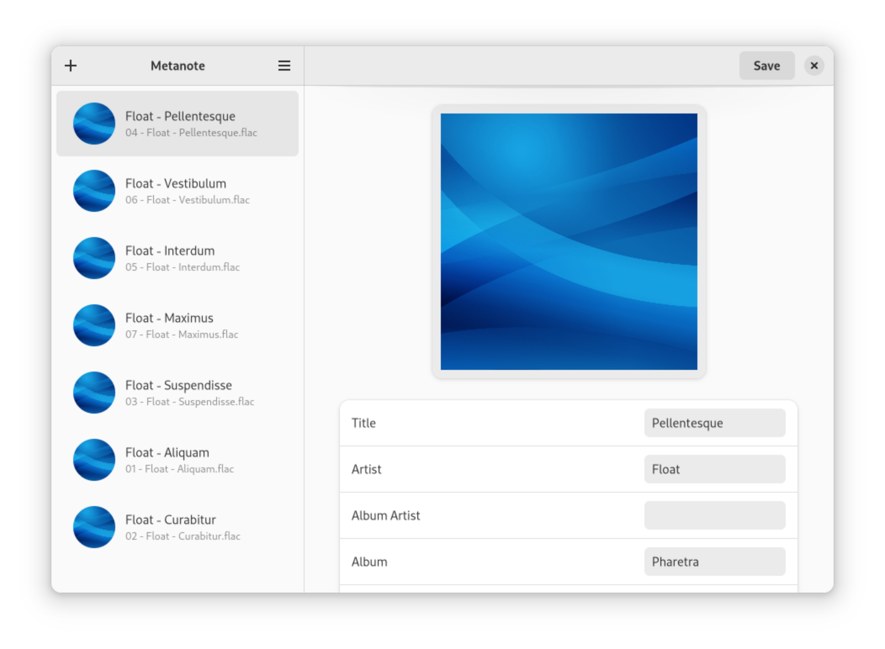

# Metanote

<div align="center"></div>

Metanote is a metadata editor for audio file formats. It is primarily targeted for the [GNOME platform](https://www.gnome.org).
Until a release is made available, this is considered a work in progress.



## Runtime dependencies

* [GTK4](https://gitlab.gnome.org/GNOME/gtk)
* [libadwaita](https://gitlab.gnome.org/GNOME/libadwaita)

## Building

### Build dependencies

* [Meson](https://github.com/mesonbuild/meson)
* [Rust](https://github.com/rust-lang/rust)

### Using Meson

```
git clone https://gitlab.com/bmreading/metanote.git
cd metanote
meson --prefix=/usr build
ninja -C build
sudo ninja -C install
```

## License

Metanote is distributed under the terms of the [GNU General Public License version](https://www.gnu.org/licenses/gpl-3.0.en.html) (GPLv3 or later).
